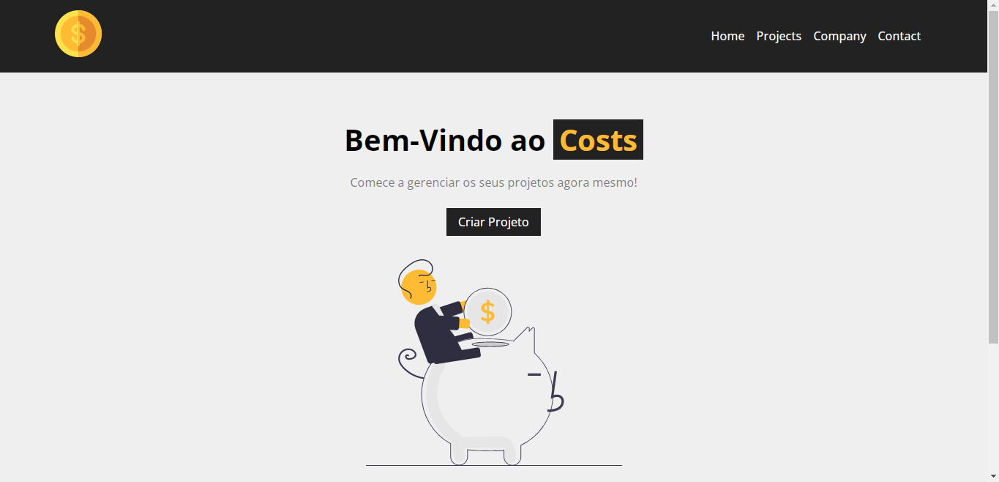
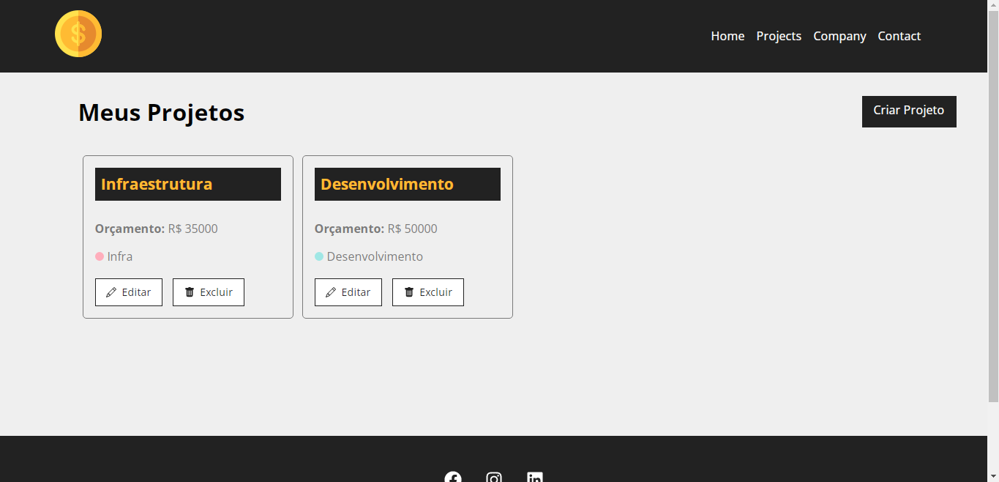
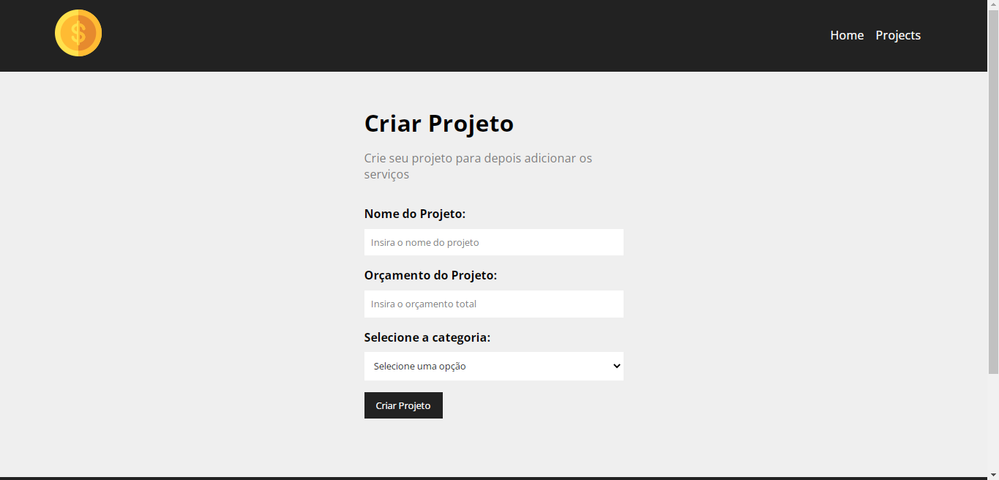
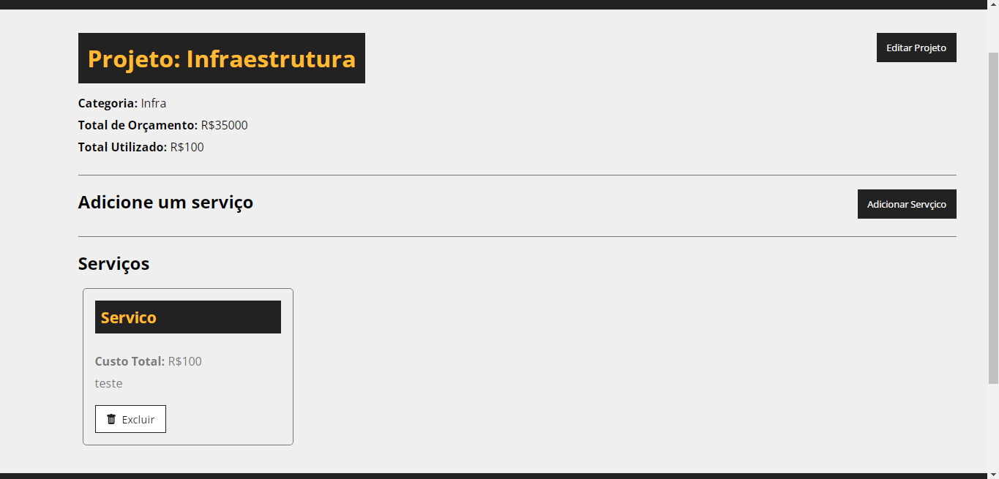

 <h1 align="center">Costs</h1>

 
O Costs tem o intuito de gerenciar os custos de um projeto, sendo eles sendo completados por serviços.

 
 
<a href="https://costs-flame.vercel.app/" target="_blank">Acesse aqui.</a>

 
  
Obs: Para iniciar o backend deve-se escrever o script: "npm run backend".

 

